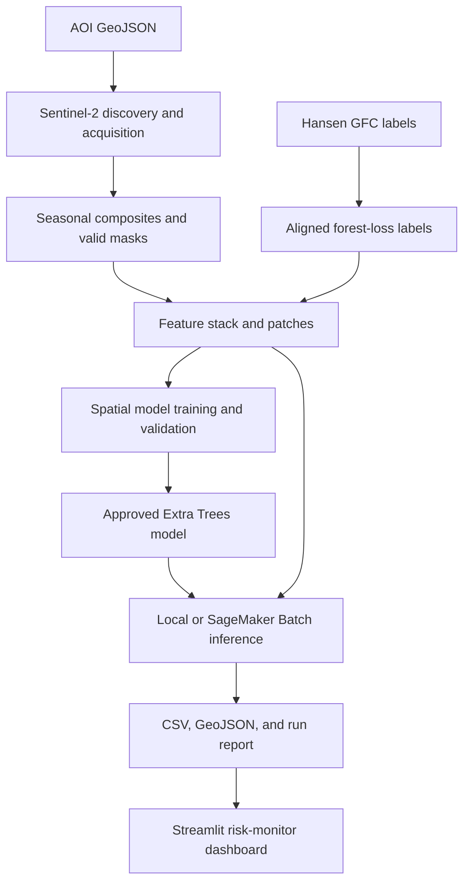

# AI-Driven Deforestation Risk Screening in Madre de Dios, Peru

An end-to-end geospatial machine-learning pipeline that uses Sentinel-2 imagery and Hansen Global Forest Change data to identify patches with elevated vegetation-loss risk. The project produces auditable tabular results, GeoJSON prediction maps, and an interactive Streamlit dashboard.

> **Scope:** This system is for deforestation / vegetation-loss risk screening. It does **not** prove illegal mining or establish the cause of vegetation loss. All alerts require analyst review and corroborating evidence.

## Project highlights

- Reproducible pipeline from area-of-interest (AOI) GeoJSON to prediction map.
- Sentinel-2 seasonal-composite processing, cloud masking, raster alignment, feature generation, and patch extraction.
- Spatially separated development, geographic test, and final geographic-holdout AOIs.
- Selected model: precision-aware `ExtraTreesClassifier`, with a locked threshold of **0.536**.
- Batch inference packaged for Amazon SageMaker Batch Transform.
- Streamlit dashboard for filtering, mapping, inspecting, and downloading predictions.

## Architecture



## Data and label contract

| Component | Final project specification |
|---|---|
| Study area | Madre de Dios, Peru |
| Optical imagery | Sentinel-2 Level-2A (`sentinel-2-l2a`) |
| Image windows | June-September 2018 baseline and June-September 2022 comparison |
| Required image assets | B02, B03, B04, B08, SCL |
| Cloud rule | Candidate scenes with cloud cover <= 20%; invalid SCL classes excluded |
| Analysis CRS | EPSG:32719 |
| Forest-change labels | Hansen Global Forest Change 2025 v1.13 |
| Eligible forest | Tree cover 2000 >= 30% |
| Positive label | Forest loss from 2019 through 2022 |
| Patch input | 11 x 32 x 32 feature tensor |

Raw Sentinel-2 imagery, Hansen source rasters, GeoTIFF intermediates, and `.npz` patch files are intentionally not stored in this repository. The scripts and manifests provide the provenance needed to reproduce them from the original data sources.

## Final model and evaluation

The selected artifact is `precision_aware_extra_trees.joblib`. The model is deliberately not committed to Git because it is 98 MB. Obtain the approved version from the repository's GitHub Release, place it at `models/task_3_14/precision_aware_extra_trees.joblib`, and verify its SHA-256 checksum:

```text
40E198846735997BBBBFAA76FD7FB790499D9FA732579343180C6D85514C33F4
```

| Evaluation split | ROC-AUC | PR-AUC | Precision | Recall | F1 |
|---|---:|---:|---:|---:|---:|
| Validation | 0.8696 | 0.6025 | 0.7301 | 0.4848 | 0.5827 |
| Geographic test | 0.7472 | 0.2741 | 0.1668 | 0.3957 | 0.2347 |
| Final geographic holdout | 0.8714 | 0.6738 | 0.9126 | 0.4185 | 0.5738 |

The geographic-test result shows that performance can vary substantially across locations. This is why the dashboard is a prioritization tool for human review, not an automated enforcement or mining-detection system.

## Demonstrated inference run

The held-out Huepetuhe inference AOI uses the same 2018-2022 comparison workflow.

| Output | Result |
|---|---:|
| Valid input patches | 30,143 |
| Accepted predictions | 30,143 |
| Rejected patches | 0 |
| Alerts at threshold 0.536 | 14,079 |

Repository demonstration inputs are under `reports/inference/huepetuhe_2018_2022/`:

- `aoi_summary.csv`
- `prediction_map.geojson`
- `run_report.json`

The patch-level `predictions.csv` and `rejected_patches.csv` are excluded from Git because they are bulk outputs. They remain part of the local and cloud run archive.

## Repository layout

```text
config/                       Pipeline and final Task 3.14 configurations
data/aoi/                     AOI GeoJSON definitions
data/manifests/               Data provenance and validation metadata
docs/                         Architecture, model card, data sheet, runbook, screenshots
reports/                      Curated metrics, charts, and demo-ready inference outputs
sagemaker_inference_package/  SageMaker Batch Transform packaging and deployment utilities
src/                          Acquisition, processing, feature, modeling, inference, validation code
tests/                        Automated unit tests
streamlit_app.py              Interactive prediction-map dashboard
```

## Documentation

- [System architecture](docs/ARCHITECTURE.md)
- [Model card](docs/MODEL_CARD.md)
- [Data sheet](docs/DATA_SHEET.md)
- [Operations runbook](docs/RUNBOOK.md)
- [Step 11/12 rubric evidence](docs/RUBRIC_EVIDENCE.md)

## Local setup

Prerequisites: Python 3.10+ and PowerShell on Windows (or an equivalent shell).

```powershell
git clone https://github.com/vsolanki76771215/deforestation-risk-screening.git deforestation-capstone
Set-Location deforestation-capstone
python -m venv .venv
.\.venv\Scripts\Activate.ps1
pip install -r requirements.txt
pip install -r requirements-streamlit.txt
```

Download the approved model release to `models/task_3_14/precision_aware_extra_trees.joblib`, then verify it:

```powershell
Get-FileHash models\task_3_14\precision_aware_extra_trees.joblib -Algorithm SHA256
```

## Run the dashboard

Run the included lightweight Huepetuhe demonstration package:

```powershell
streamlit run streamlit_app.py -- --inference-dir reports/demo/huepetuhe_sample
```

The dashboard supports AOI filtering, probability filtering, alert-only display, map inspection, run-lineage review, and filtered CSV/GeoJSON downloads. The demo is a 250-patch representative subset; use `--inference-dir reports/inference/<run_id>` for a full local or cloud inference run. If required output files are missing, the app displays a clear command example rather than returning a misleading result.

Create the committed demo package from the full local Huepetuhe output:

```powershell
python src\inference\create_streamlit_demo_package.py `
  --source-dir reports\inference\huepetuhe_2018_2022 `
  --output-dir reports\demo\huepetuhe_sample `
  --max-patches 250
```

## Run tests and validation

```powershell
pytest -q

python src\validation\validate_inference_outputs.py `
  --output-dir reports\inference\huepetuhe_2018_2022
```

Validation scripts under `src/validation/` cover AOIs, labels, features, patch extraction, modeling datasets, model artifacts, domain-shift diagnostics, and inference outputs.

## Use the model for a future AOI

1. Create a WGS84 AOI GeoJSON in `data/aoi/`.
2. Run Sentinel-2 discovery, scene ranking, and composite generation using the final configuration contract.
3. Build the inference feature stack and extract valid feature patches.
4. Run `src/inference/run_patch_inference.py` with the approved model and threshold.
5. Validate the resulting output directory with `validate_inference_outputs.py`.
6. Open the output in Streamlit and have an analyst review the highest-risk patches with independent imagery or field/context data.

The final configurations and manifest formats must remain unchanged unless the model is retrained and re-evaluated. Keep the model artifact, feature schema, threshold, input manifest hash, and output `run_report.json` together for every run.

## SageMaker Batch Transform

The `sagemaker_inference_package/` directory contains the CPU-oriented container handler and utilities to:

1. package the selected model,
2. prepare and shard JSON Lines batch input,
3. run a local 25-record handler smoke test,
4. submit a SageMaker Batch Transform job, and
5. postprocess JSON Lines output into dashboard-ready CSV, GeoJSON, and run-report artifacts.

See [`sagemaker_inference_package/README.md`](sagemaker_inference_package/README.md) for the operational workflow. Before final submission, this project will also provide a public URL for the deployed Streamlit interface and an API endpoint or documented Batch Transform request contract.

## Limitations and responsible use

- Vegetation loss may be caused by agriculture, roads, natural disturbance, or other activity; an alert is not proof of mining.
- Performance may shift across geography, time, sensors, clouds, or land-cover conditions.
- Outputs depend on valid imagery coverage and the specified seasonal windows.
- Human review and corroboration are required before reporting or acting on a location.

## License and data attribution

Sentinel-2 imagery is provided through the Copernicus programme. Forest-change labels are derived from Hansen Global Forest Change data. See the project data sheet for complete source, version, and attribution details.
