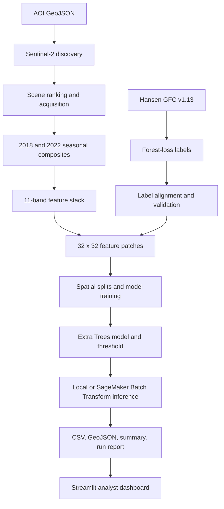
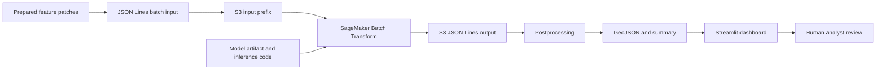

# System Architecture

## Purpose

This project screens Sentinel-2 imagery for patches with elevated deforestation / vegetation-loss risk in Madre de Dios, Peru. It is not a system for confirming illegal mining or for autonomous enforcement decisions.

## Training and inference flow

## Component contract

| Component | Input | Output | Key control |
|---|---|---|---|
| Sentinel-2 discovery | AOI, seasonal date range, cloud limit | Candidate-scene manifest | Scene IDs and query metadata recorded |
| Compositing | Selected source bands and SCL | 2018/2022 composites and valid masks | Cloud/SCL mask and coverage threshold |
| Labeling | Hansen loss year and tree cover | Binary aligned loss raster | Tree cover >= 30%; loss years 2019-2022 |
| Features | Both composites and masks | 11-band feature GeoTIFF | EPSG:32719 alignment and nodata checks |
| Patch extraction | Feature/label rasters | 32 x 32 `.npz` patches and manifest | Invalid coverage and spatial-boundary checks |
| Model | Patch summary features | Risk probability and binary alert | Locked threshold 0.536 |
| Inference report | Accepted/rejected predictions | CSV, GeoJSON, AOI summary, JSON run report | Hashes, counts, threshold, model lineage |

## Deployment architecture

The SageMaker workflow is asynchronous batch inference. It is not a persistent real-time prediction endpoint.

## Stored outputs

- `predictions.csv`: patch-level probability, prediction, threshold, spatial offsets, and metadata.
- `rejected_patches.csv`: rejected input records and reasons.
- `aoi_summary.csv`: AOI-level patch and alert summary.
- `prediction_map.geojson`: patch polygons for mapping.
- `run_report.json`: run lineage, hashes, threshold, accepted/rejected counts, and scope statement.

Only the small repository demo package is committed. Full rasters, patch files, batch inputs, full predictions, and model binaries remain local or in cloud storage.
